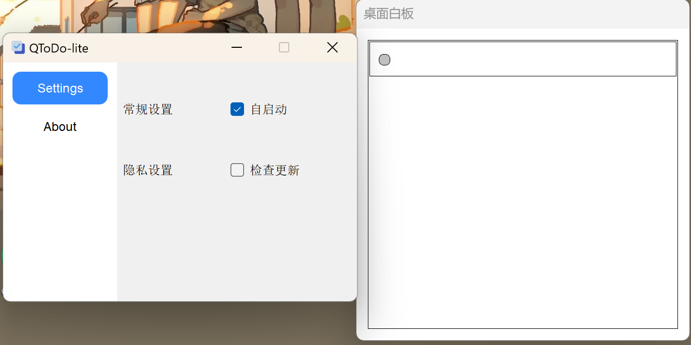
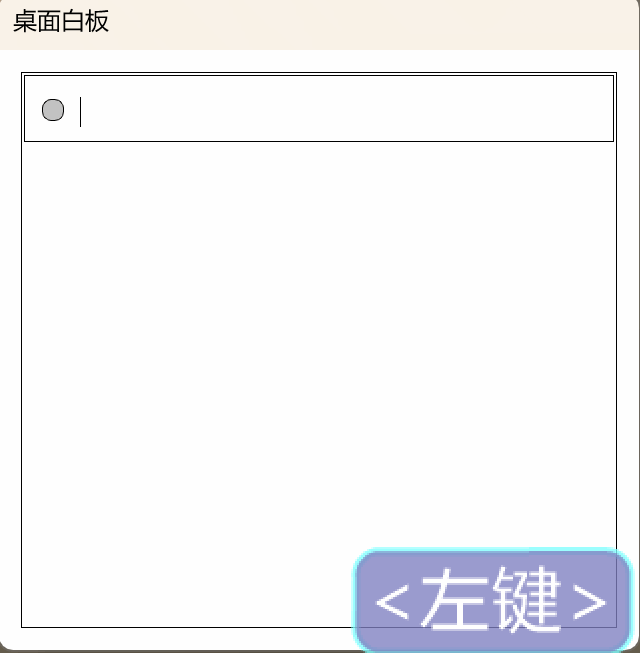

# QToDo-lite
****
## 简介
QToDo-lite 是一个轻量级的任务管理工具，旨在帮助用户高效地管理和跟踪日常任务。它支持跨平台运行（Windows 和 Linux），并且具有简洁直观的用户界面。

## 运行截图

#### Windows 版本 和 Linux(Ubuntu 20.04)
**Windows**

**Linux**

## 功能特性
- **任务管理**：快速添加、编辑和删除任务。

## 技术栈
- **编程语言**：C++
- **框架**：Qt
- **操作系统**：Windows, Linux

## 使用方法
安装、启动软件后，桌面会弹出对应窗口
- 点击窗口区域，会自动定位到最后一条任务
- 按下回车，新建一条任务
- 双击任务，可以编辑任务内容
- 按下任务前的按钮，即可删除
