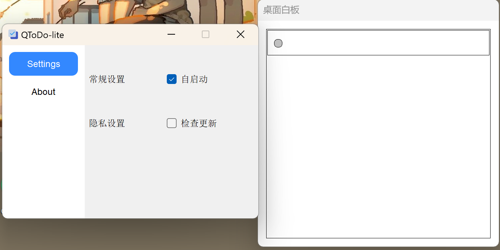
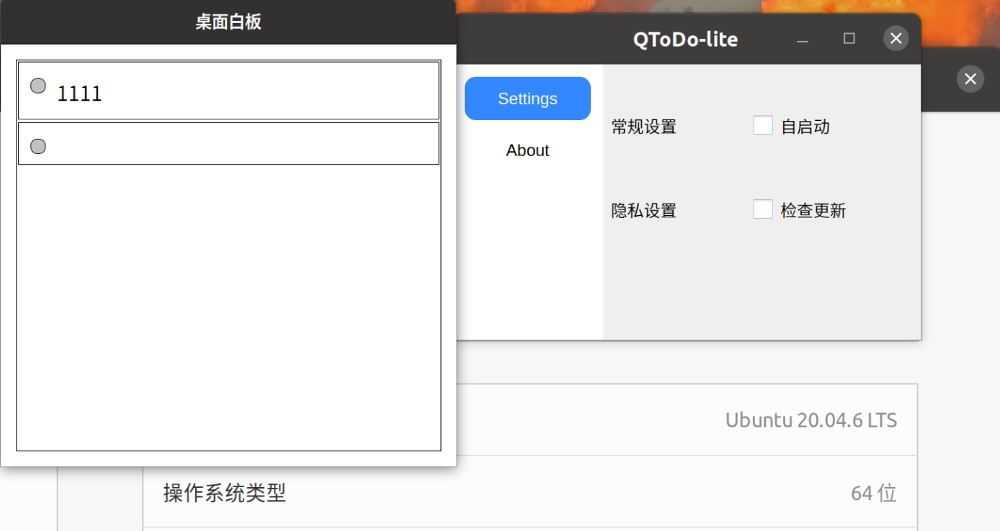
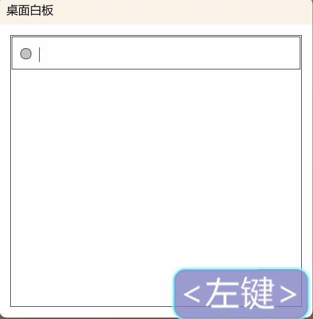

QToDo-lite
****
[中文文档](docs/readme_zh.md)
## Introduction
QToDo-lite is a lightweight task management tool designed to help users efficiently manage and track their daily tasks. It supports cross-platform operation (Windows and Linux) and features a clean, intuitive user interface.

### Screenshots
Windows Version and Linux(Ubuntu 20.04)
**Windows**

**Linux**

## Features
- **Task Management**: Quickly add, edit, and delete tasks.

## Technology Stack
- **Programming Language**: C++
- **Framework**: Qt
- **Operating Systems**: Windows, Linux

## How to Use
After installation and launching the software, the corresponding window will pop up on the desktop.

- Clicking on the window area will automatically navigate to the last task.
- Press Enter to create a new task.
- Double-click a task to edit its content.
- Press the button before a task to delete it.
### Demonstration
